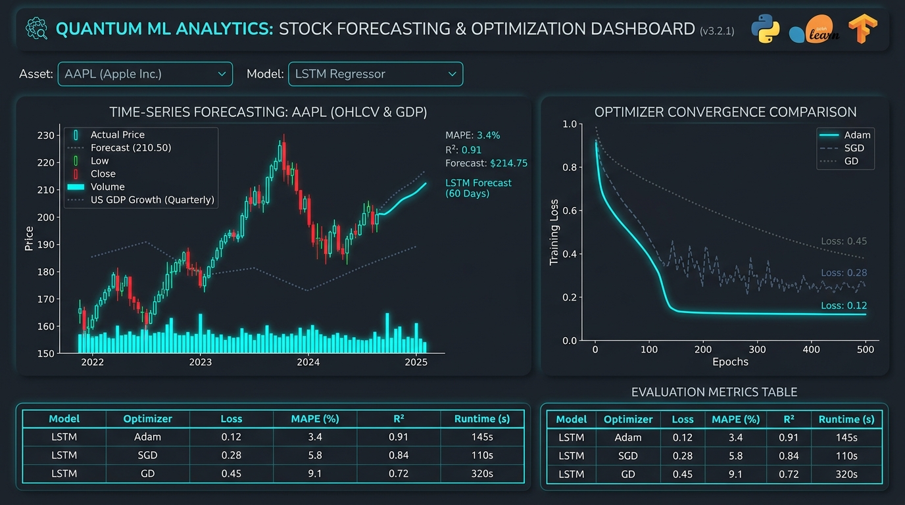

# 🚀 Performance Optimization Plan — My Portfolio

## Tổng quan vấn đề

Sau khi phân tích toàn bộ codebase, đã xác định được các điểm nghẽn hiệu năng sau:

| Vấn đề | Mức độ | Ảnh hưởng |
|--------|--------|-----------|
| Ảnh chưa được tối ưu (PNG/JPG, không lazy load) | 🔴 Cao | LCP, Total Payload |
| `index.html` quá lớn (~195 KB) | 🔴 Cao | TTFB, Parse time |
| 18 file JS riêng lẻ, không defer async | 🔴 Cao | Blocking render |
| `tailwind.css` 53 KB (nhiều unused rules) | 🟠 Trung bình | CSS parse time |
| `backdrop-filter: blur()` dùng ở 20+ chỗ | 🟠 Trung bình | GPU compositing |
| `filter: blur(85px)` trên aurora orbs | 🟠 Trung bình | Paint layer cost |
| `particles.js` load đồng bộ trước body | 🟠 Trung bình | Blocking render |
| `github-stats.js` dùng `Date.now()` làm cache-buster | 🟡 Thấp | Cache invalidation |
| SW không cache các module JS mới | 🟡 Thấp | Offline support |
| `scroll-behavior: smooth` trên `body` | 🟡 Thấp | Overrides scroll API |
| Không có `font-display: swap` | 🟡 Thấp | FOIT (Flash of invisible text) |
| Không có `<link rel="preload">` cho critical assets | 🟡 Thấp | LCP delay |
| `contain:` chỉ dùng 2 chỗ | 🟡 Thấp | Layout thrashing |

---

## Open Questions

> [!IMPORTANT]
> **Câu hỏi 1**: Bạn có muốn chuyển đổi ảnh dự án (PNG/JPG) sang định dạng **WebP** không? Việc này sẽ giảm ~60-80% dung lượng ảnh nhưng cần convert lại file và cập nhật `src` trong HTML.

> [!IMPORTANT]
> **Câu hỏi 2**: Bạn có muốn **bundle + minify** tất cả 18 JS module thành 1-2 file duy nhất không? Cần thêm build step (esbuild/rollup), nhưng giảm được 18 HTTP requests xuống còn 2-3.

> [!NOTE]
> **Câu hỏi 3**: `particles.js` hiện đang block render. Bạn muốn giữ particles nhưng load chúng **lazy** (sau khi trang xong), hay bỏ hẳn để đơn giản hóa?

---

## Proposed Changes

### 🖼️ Phase 1 — Image Optimization (Impact: LCP ↓ 50-70%)

#### [MODIFY] [index.html](file:///d:/CODE/2025/PORTFOLIO/my-portfolio/index.html)

Thêm `loading="lazy"` và `decoding="async"` cho **tất cả** `` không ở above-the-fold:
```html
<!-- Trước -->


<!-- Sau -->

```

Thêm `<link rel="preload">` cho ảnh hero (profile1.jpg) trong `<head>`:
```html
<link rel="preload" as="image" href="assets/profile/profile1.jpg" fetchpriority="high">
```

Thêm `fetchpriority="high"` cho ảnh profile chính.

---

### 📦 Phase 2 — Resource Hints & Critical CSS (Impact: FCP ↓)

#### [MODIFY] [index.html](file:///d:/CODE/2025/PORTFOLIO/my-portfolio/index.html)

Thêm các `<link rel="preload">` và `dns-prefetch` cho external resources:
```html
<!-- Thêm vào <head> -->
<link rel="preconnect" href="https://fonts.googleapis.com">
<link rel="dns-prefetch" href="https://cdn.jsdelivr.net">
<link rel="preload" href="css/styles.css?v=13" as="style">
<!-- Font preload với font-display: swap -->
<link href="https://fonts.googleapis.com/css2?family=Inter:wght@400;600&family=Poppins:wght@300;400;600;700&display=swap&font-display=swap" rel="stylesheet">
```

---

### ⚡ Phase 3 — JavaScript Optimization (Impact: TTI ↓, Blocking ↓)

#### [MODIFY] [index.html](file:///d:/CODE/2025/PORTFOLIO/my-portfolio/index.html)

Chuyển tất cả `<script>` tag cuối body sang dùng `defer`:
```html
<!-- Trước -->
<script src="js/data/i18n.data.js"></script>

<!-- Sau -->
<script src="js/data/i18n.data.js" defer></script>
```

Load `particles.js` lazy chỉ sau khi trang idle:
```html
<!-- Trước: load đồng bộ -->
<script src="https://cdn.jsdelivr.net/npm/particles.js@2.0.0/particles.min.js"></script>

<!-- Sau: load khi idle -->
<script>
  window.addEventListener('load', () => {
    const s = document.createElement('script');
    s.src = 'https://cdn.jsdelivr.net/npm/particles.js@2.0.0/particles.min.js';
    s.onload = () => window._initParticles?.();
    document.body.appendChild(s);
  });
</script>
```

#### [MODIFY] [js/scripts.js](file:///d:/CODE/2025/PORTFOLIO/my-portfolio/js/scripts.js)

Tách init particles thành function `_initParticles` riêng để gọi sau khi script load.

---

### 🎨 Phase 4 — CSS Performance (Impact: Paint cost ↓)

#### [MODIFY] [css/base/tokens.css](file:///d:/CODE/2025/PORTFOLIO/my-portfolio/css/base/tokens.css)

Xóa `scroll-behavior: smooth` khỏi `body` (đã có JS smooth scroll) để tránh conflict:
```css
/* Xóa dòng này */
scroll-behavior: smooth;
```

Thêm `content-visibility: auto` cho các section below-the-fold:
```css
/* Thêm vào section styles */
section:not(#home) {
  content-visibility: auto;
  contain-intrinsic-size: 0 600px;
}
```

#### [MODIFY] [css/base/animations.css](file:///d:/CODE/2025/PORTFOLIO/my-portfolio/css/base/animations.css)

Tối ưu aurora orbs — giảm `filter: blur(85px)` xuống để bớt tải GPU, và chuyển sang dùng `contain: strict` thay vì `contain: layout style paint`:

```css
/* Giảm blur radius và thêm contain để giới hạn paint */
.section-aurora-orb {
  /* ... giữ nguyên ... */
  contain: strict;          /* ← thay vì layout style paint */
  isolation: isolate;       /* ← tạo stacking context riêng */
}
```

#### [NEW] css/base/performance.css

Tạo file CSS mới dành riêng cho performance utilities:
```css
/* content-visibility cho sections */
/* GPU promotion hints */
/* print optimization */
/* reduced-motion extended rules */
```

---

### 🔧 Phase 5 — Service Worker Improvements (Impact: Offline + Cache)

#### [MODIFY] [sw.js](file:///d:/CODE/2025/PORTFOLIO/my-portfolio/sw.js)

- Bump `VERSION` lên `v14`
- Thêm vào PRECACHE list các module JS còn thiếu: `i18n.js`, `theme.js`, `cert-modal.js`, `cert-filter.js`, `email-copy.js`, `contact-form.js`, `github-stats.js`, `ui-interactions.js`, `i18n.data.js`, `skills.data.js`
- Thêm CSS modules vào PRECACHE
- Sửa `github-stats.js`: đổi cache-buster `Date.now()` → dùng version hash để tránh re-request SVG mỗi lần render:

```js
// Thay vì cache-bust mỗi lần theme đổi:
const v = Date.now(); // ← xấu

// Dùng session-based version:
const v = window._githubSvgVersion ??= performance.now().toFixed(0);
```

---

### 📊 Phase 6 — Scroll & Layout Performance (Impact: FPS ↑)

#### [MODIFY] [js/modules/ui-interactions.js](file:///d:/CODE/2025/PORTFOLIO/my-portfolio/js/modules/ui-interactions.js)

Tối ưu `initScrollProgressBar()` — cache `document.documentElement` ngoài scroll handler:

```js
// Đã có cơ bản tốt, thêm: debounce resize observer
const ro = new ResizeObserver(() => {
  maxScroll = d.scrollHeight - d.clientHeight;
});
ro.observe(d);
```

#### [MODIFY] [js/scripts.js](file:///d:/CODE/2025/PORTFOLIO/my-portfolio/js/scripts.js)

ScrollSpy hiện dùng `s.offsetTop` trong loop → gây layout thrashing. Cải thiện bằng cách cache offsets và re-compute chỉ khi resize:

```js
// Thêm offset cache
let sectionOffsets = [];

function recalcOffsets() {
  sectionOffsets = sections.map(s => s.offsetTop);
}

window.addEventListener('resize', recalcOffsets, { passive: true });
recalcOffsets(); // initial

// Trong scroll handler: dùng sectionOffsets thay vì s.offsetTop
```

---

## Verification Plan

### Lighthouse Audit
- Chạy Lighthouse trước và sau mỗi phase
- Target: Performance score ≥ 90, LCP < 2.5s

### Manual Verification
- Kiểm tra smooth scroll không bị giật
- Kiểm tra lazy loading images trên Network tab (Chrome DevTools)
- Kiểm tra `defer` không phá vỡ thứ tự init modules
- Test offline mode với SW mới

### Chrome DevTools
- Performance tab: xem Main thread blocking time
- Coverage tab: xem unused CSS/JS %
- Network tab: xem total transfer size

---

## Thứ tự ưu tiên thực thi

```
Phase 1 (Ảnh) → Phase 3 (JS defer) → Phase 2 (Resource hints)
→ Phase 4 (CSS perf) → Phase 5 (SW) → Phase 6 (Scroll)
```

> [!TIP]
> Phase 1 + 3 sẽ cho impact lớn nhất với effort ít nhất. Có thể deploy từng phase độc lập.

> [!WARNING]
> Khi thêm `defer` vào tất cả scripts, cần verify thứ tự phụ thuộc: `i18n.data.js` → `i18n.js` → `theme.js` → feature modules → `scripts.js`. Với `defer`, thứ tự DOM sẽ được tôn trọng nên vẫn an toàn.
